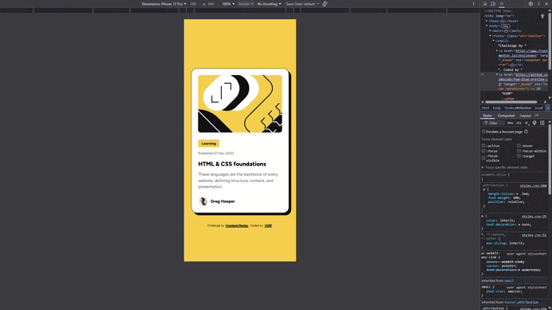

# **Blog Preview Card – Frontend Mentor Challenge**

This is my solution to the [Blog Preview Card challenge](https://www.frontendmentor.io/challenges/blog-preview-card-ckPaj01IcS) from Frontend Mentor. The goal of this challenge is to recreate a responsive blog preview card using semantic HTML and modern CSS techniques.

## 🎯 **The challenge**

Users should be able to:

* See hover and focus states for all interactive elements
* View the layout optimally on different screen sizes
* Navigate the component with semantic, accessible HTML

## 📸 **Preview**

### 🎞️ Demo

### 📱 Mobile

### 💻 Desktop

|  |  |
| --- | --- |

## 🔗 **Links**

* [Live site URL &nearrow;](https://vimpcode.github.io/fem-blog-preview-card/)

## ⚒️ **Built with**

* Semantic **HTML5**
* **CSS Custom Properties**
* **CSS Grid**
* **Flexbox**
* **Native CSS Nesting**
* **Mobile-first workflow**

## 📖 **What I learned**

This project helped me strengthen foundational front-end skills, especially:

* Structuring a component with clean, semantic HTML (`article`, `header`, `footer`).
* Using **CSS Nesting** natively, without preprocessors.
* Applying responsive typography using `clamp()`.
* Creating consistent spacing using a simple custom property system.
* Managing focus and hover states in an accessible way.
* Improving layout composition using Grid for the card structure.

## 👤 **Author**

* Frontend Mentor – [@vimpcode](https://www.frontendmentor.io/profile/vimpcode)
